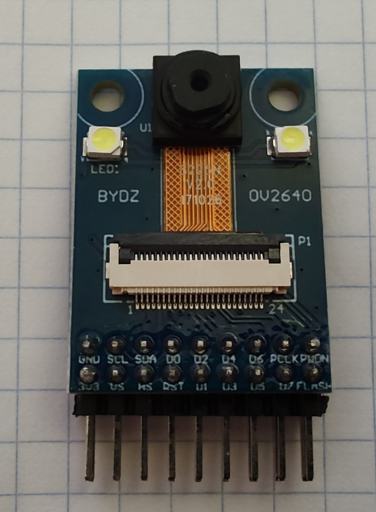
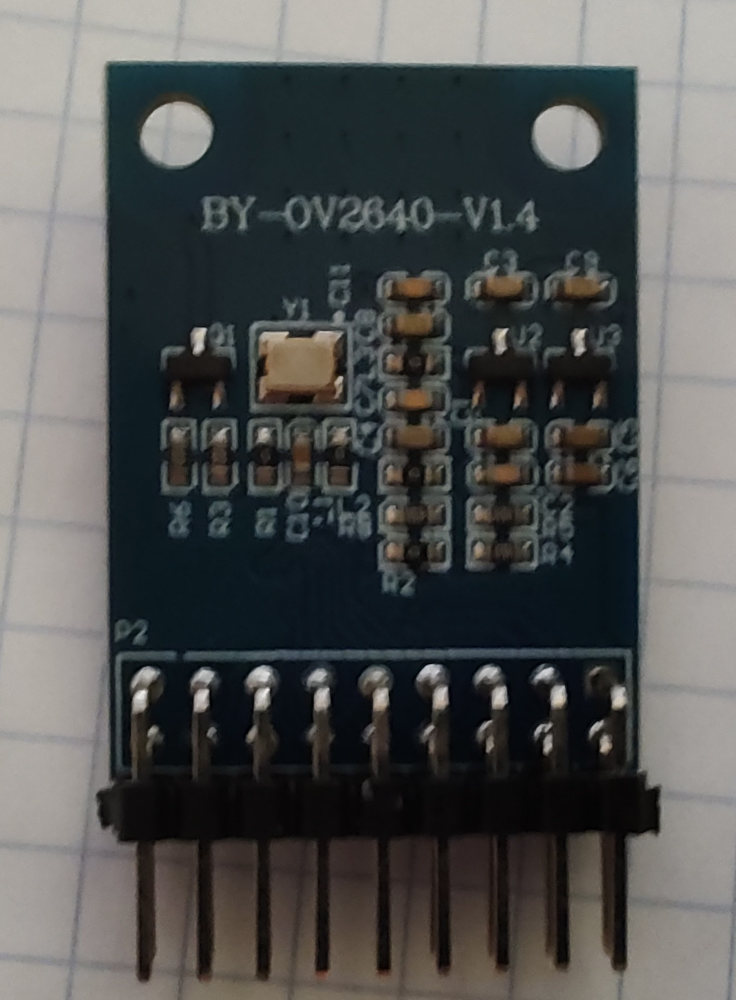
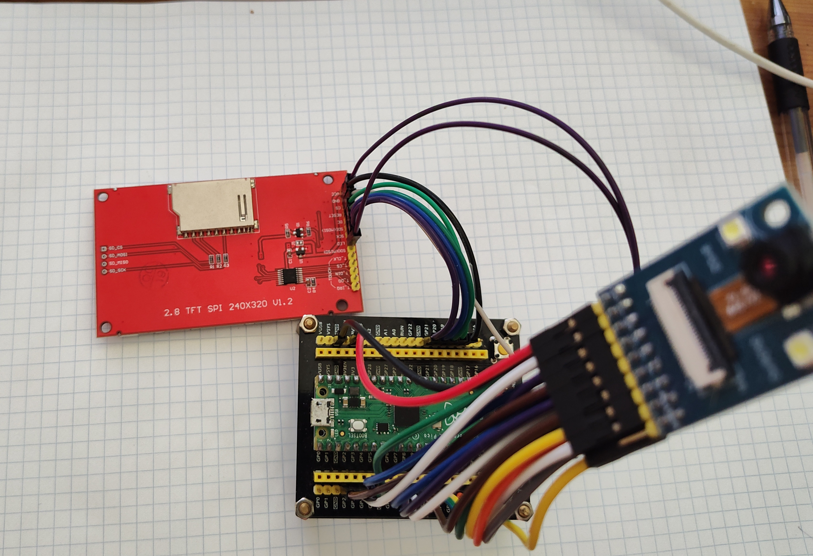
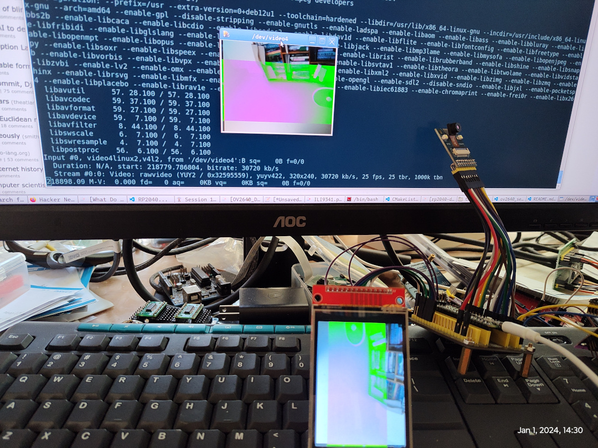
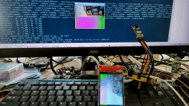

# USB video class(UVC) for Pico

Capture video on your [Raspberry Pi Pico](https://www.raspberrypi.com/products/raspberry-pi-pico/) with a [tinyUSB](https://github.com/hathach/tinyusb) library.

## Hardware
* RP2040 board
* [Raspberry Pi Pico](https://www.raspberrypi.org/products/raspberry-pi-pico/)
* ov2640 camera module within 24Mhz osc
* ILI9341 2.8 TFT SPI 240x420 V1.2 LCD module






## Build

```sh
~$ git clone --recurse-submodules https://github.com/yjdwbj/uvc_for_pico.git
~$ cd uvc_for_pico && mkdir build
~$ cd build; cmake -DUSE_FREERTOS=1 ../ && make
```

## Tips

* `cmake -DUSE_FREERTOS=1` will enable `FreeRTOS` support which is recommand, otherwise use `main loop` instead.
* If you set the OV2640 pixel format to `RGB565`, write the frame buffer directly to `LCD` and convert `rgb565 -> yuv422` to `UVC` stream.
* If you set the OV2640 pixel format to `YUV422`, write the frame buffer directly to `UVC` and convert `yuv422 -> rgb565` to `LCD`. But there is a serious bug here, green/inverted block areas are very frequent.

## Demo run


### Default Pinout

| RP2040 | OV2640 | ILI9341 |
|:------:|:------:|:-------:|
|  VCC   |   3v3  |   3v3   |
|  GND   |   GND  |   GND   |
|  5     |  SIOC  |         |
|  4     |  SIOD  |         |
|  2     |  REST  |         |
|  3     | VSYNC  |         |
|  6     |   D0   |         |
|  7     |   D1   |         |
|  8     |   D2   |         |
|  9     |   D3   |         |
|  10    |   D4   |         |
|  11    |   D5   |         |
|  12    |   D6   |         |
|  13    |   D7   |         |
|  14    |  PCLK  |         |
|  15    |  HSYNC |         |
|  18    |        |  RESET  |
|  19    |        |  RS/DC  |
|  20    |        |  CLK    |
|  21    |        |  MOSI   |
|  VCC   |        |   LED   |
|  GND   |        |   CS    |


## V42l-ctrl examples

* query the capture formats the video device supports

```sh
v4l2-ctl -d 0 --list-formats-ext
ioctl: VIDIOC_ENUM_FMT
        Type: Video Capture

        [0]: 'YUYV' (YUYV 4:2:2)
                Size: Discrete 320x240
                        Interval: Stepwise 0.040s - 1.000s with step 0.040s (1.000-25.000 fps)
```

* capture raw video stream from by v4l2-ctl.
```sh
v4l2-ctl --device /dev/video0
--set-fmt-video=width=320,height=240,pixelformat=YUYV --stream-mmap
--stream-to=frame.raw --stream-count=1
```

* converted into JPEG format by ffmpeg.
```sh
ffmpeg -y -s:v 320x240 -pix_fmt yuyv422 -i frame.raw frame.jpg
```

## FFmpeg examples

* play video from uvc device on linux.
```sh
ffplay  -f v4l2 -framerate 25  -video_size 320x240  -i /dev/video0
```
